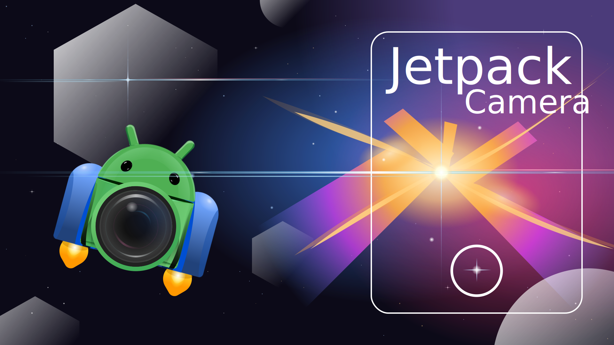

# Origin Camera

Origin Camera is a feature-rich Android camera app forked from Google's [Jetpack Camera App](https://github.com/android/camera-samples/tree/main/JetpackCamera). It is built entirely with **CameraX**, **Kotlin**, and **Jetpack Compose**, following modern Android development best practices.

Beyond upstream JCA's comprehensive feature set, Origin Camera adds a customized UI with dark theme, overlay gallery/filters, volume-button zoom, a log-scale zoom slider, device level indicator, dynamic lens labels, frosted glass panels, and the Funnel Sans typeface.

## Development Environment

This project uses the Gradle build system and can be imported directly into Android Studio Meerkat or newer (AGP 8.10.1).

### Pre-Push Hook (Recommended)

A `pre-push` hook automatically checks code formatting with Spotless before pushing:

```bash
git config core.hooksPath scripts/git-hooks
```

To bypass: `git push origin <branch> --no-verify`

## Architecture

Built with [modern Android development](https://developer.android.com/modern-android-development) principles — multi-module with clear separation between UI, data, and camera layers. 30+ modules organized into `:core`, `:data`, `:feature`, and `:ui` groups.

## UI Customizations

- **Dark theme** throughout — black backgrounds, `#1C1C1C` cards, shared `BottomToolbar`
- **Overlay gallery/filters** — transparent overlays on top of the live camera feed (not separate navigation destinations)
- **Volume-button zoom** — volume up/down steps zoom by 0.15×
- **Log-scale zoom slider** — precise control across the full zoom range
- **Device level indicator** — arrows showing correction direction (no 360° spin)
- **Dynamic lens labels** — shows actual focal length (base × current zoom ratio)
- **Funnel Sans typeface** — custom variable font
- **Frosted glass panels** — backdrop blur on overlay panels
- **Filters screen** — live camera preview with corner brackets + level indicator, filter cards
- **Gallery screen** — 3-column photo grid overlay

## Features

Origin Camera retains the full upstream feature set:

### Standard
Viewfinder, aspect ratio, image capture, tap to focus, flip camera, zoom, flash

### Video
Video capture, pause/resume, duration limit, video quality, audio visualization, frame rate, stabilization, flip while recording

### Advanced
Screen flash, dual concurrent camera, HDR (10-bit video / Ultra HDR image), low-light boost, single/multi-stream

### Special
Debug mode, intent capture modes, dark mode, media saving and review (immediate or cache-and-review)

## Testing

Uses Compose Test and UI Automator for on-device instrumentation tests. Run with Gradle Managed Device:

```bash
./gradlew pixel2Api28StableDebugAndroidTest
./gradlew pixel8Api34StableDebugAndroidTest
```

## License

Origin Camera is a fork of [Jetpack Camera App](https://github.com/android/camera-samples/tree/main/JetpackCamera) by Google, which is licensed under the Apache License, Version 2.0.

```
Copyright 2024 The Android Open Source Project
Copyright 2025 Origin Camera contributors

Licensed under the Apache License, Version 2.0 (the "License");
you may not use this file except in compliance with the License.
You may obtain a copy of the License at

    https://www.apache.org/licenses/LICENSE-2.0

Unless required by applicable law or agreed to in writing, software
distributed under the License is distributed on an "AS IS" BASIS,
WITHOUT WARRANTIES OR CONDITIONS OF ANY KIND, either express or implied.
See the License for the specific language governing permissions and
limitations under the License.
```
